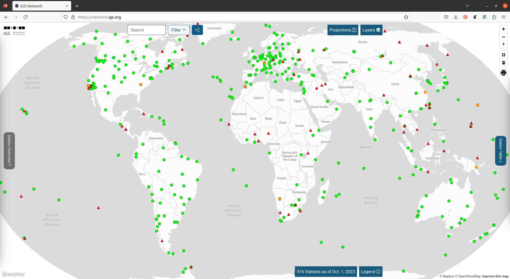
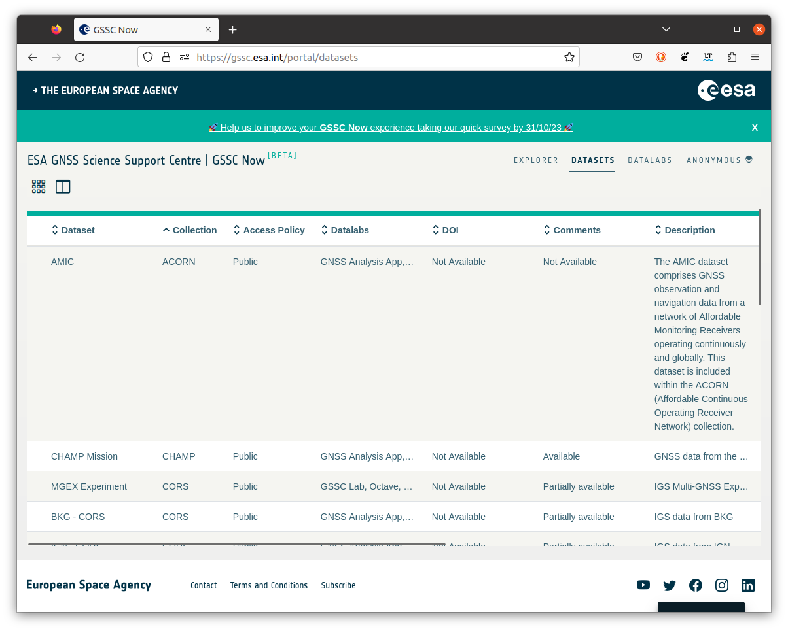
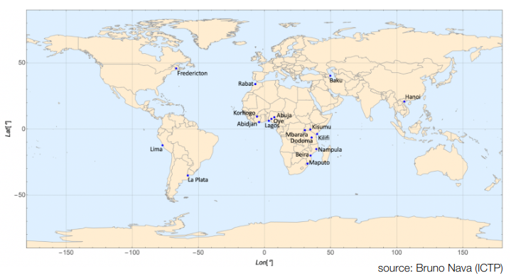
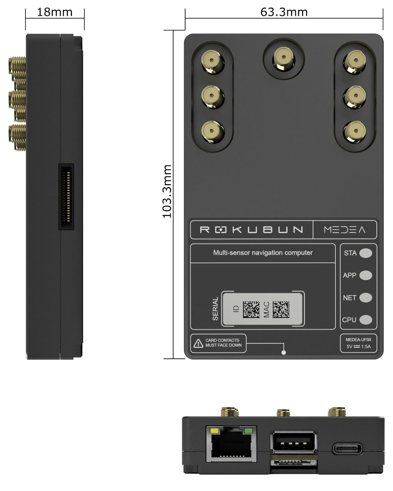
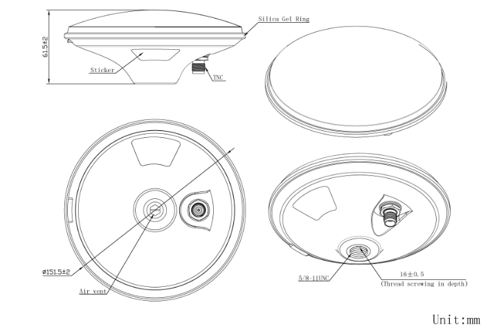

# AMIC project

**A**ffordable **M**onitoring of the **I**onosphere and Observable **C**haracterization

Is a project funded by the European Space Agency[^contractnum] to build an
affordable dense network of GNSS Continuousy Operating Reference Stations,
specially suited for remote areas.

## Why another network?

The main problem of current networks are the areas with scarcity of GNSS
receivers (e.g. deserts). Look for instance in Africa, northern latitudes, Western South America, ... In addition, for ionospheric activities, these are *interesting* areas to monitor due to the presence of the Equator anomaly or the presence of Auroras.



In order to remedy this, **AMIC** proposes the deployment of **ACORN** (**A**MIC **C**ontinuousy **O**perating **R**eference Station **N**etwork),
a network based entirely on affordable receivers logging data and sending them to the [ESA's GSSC](https://gssc.esa.int/portal/) data repository.



An important point of th project and the network is that the
**data will be publicly available**. A first set of deployment sites of the ACORN network can be seen in the following figure.



Albeit special emphasis is placed on African sites, locations in other
continents are also being considered.

## The network receivers

The AMIC GNSS receiver is a receiver based on the [u-blox ZED-F9P](https://www.u-blox.com/en/product/zed-f9p-module) GNSS chipset, which is a dual frequency (L1/L2/E5b) receiver able to track multiple constellations (GPS, Galileo, Beidou, Glonass, QZSS, ...).

The power consumption of the device is very low (similar to the consumption of a Raspberry Pi).

The device will transfer around 35 Mbytes per day of data to ESA servers in Europe.



The antenna corresponds to an [Inchang JCA228B](http://www.jinchanggps.com/JCA228B-pd46958135.html) multi-frequency GNSS antenna



The AMIC receivers have these additional characteristics:

- are **affordable** enough (~ 1k€) so that they might be easier to replace in the likely event that the device is lost or damaged in remote areas, where human access can be challenging.
- they are shipped **preconfigured** so that they have to be plugged and left. The standard configuration is logging of GNSS pseudoranges, carrier-phase, Doppler and SNR at 1Hz rate
- Storing data in **RINEX** file, with file rotation of 15 minutes.
- Whenever a new RINEX file is available and connectivity is up, it will be **automatically uploaded** to ESA's GSSC servers.
- The receiver can handle intermittent Internet connectivity outages, as it can store ca 1 month worth of data.

```{admonition} Want to host a receiver?
Fill out this [form](https://forms.gle/VMpzRQvP6fnRSeiw6)
```

[^contractnum]: ESA contract number 4000130532/20/NL/AS/hh