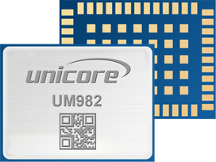

# Affordable receivers

With the reduction of cost in chipsets and technologies, the GNSS sector is also
experiencing a change in paradigm in terms of hardware cost as well. Centimetric
accuracy used to require expensive hardware (GNSS chipset/receiver and good quality
antenna), but nowadays alternatives are already in the market.

The trend was started by chipset manufacturers that launched System-on-Chip (SoC)
at a very competitive price. Examples of such systems are:

- u-blox (ZED-F9 family), dual-frequency, ~100€ per unit
- Septentrio Mosaic receiver, multi-constellation, triple-frequency, ~500€ per units
- Unicorecomm UM982, multi-constellation, triple-frequency, ~400€ per units

||||
|:---:|:---:|:----:|
|  |  |  |

A critical aspect of affordable receivers is not only the GNSS chipset itself, but the
antenna as well. This will be also largely responsible for the quality of the
GNSS observables/measurements and, therefore, the accuracy that can be achieved in
the estimation of the position. For maximum accuracy, Choke ring antennas
(see left panel of Figure below) are usually employed. However, budget antennas
such as the one shown in the right panel of the following Figure, are capable
of providing good quality measures, as will be shown in this section.

|||
|:---:|:---:|
| |  |

Examples of bduget GNSS antennas that can offer good measurement quality are:

- Tallysman TW7972, dual frequency, ~200€ per unit
- Jinchang JCA228B, dual-frequency, ~60€ per unit

These hardware needs to be integrated. Evaluation kits with a Raspberry Pi might work but eventually the whole set of components needs to be integrated (which adds cost). An example of a GNSS device that integrates budget chipset and antenna is Rokubun's MEDEA computer (see Figure below), based on a u-blox ZED-F9P and an application processor to load third-party software to process GNSS measurements (as done in the [AMIC project](./amic.md))

