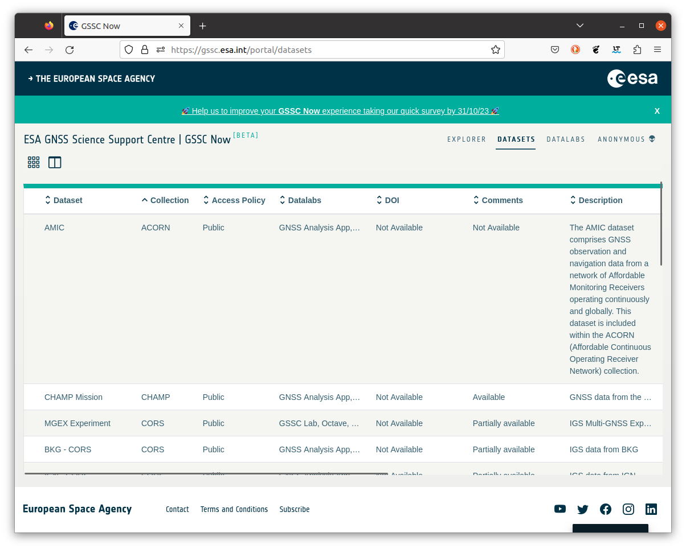
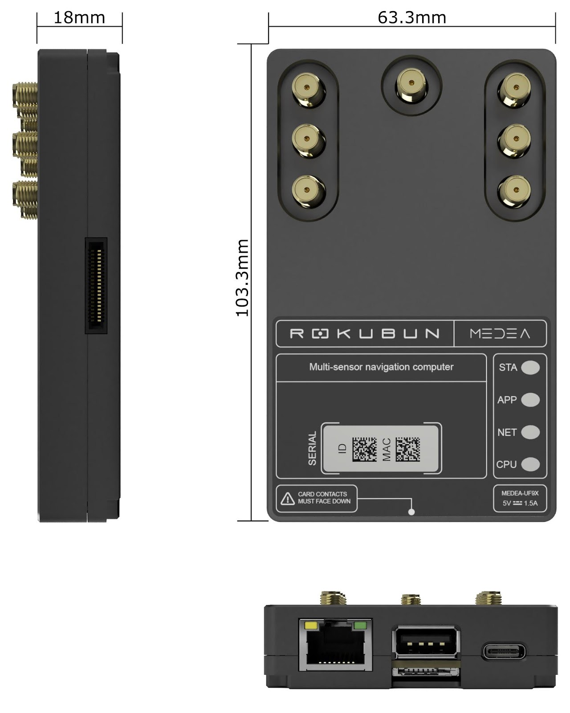

# Related projects

This section includes projects related to the contents included in this documentation

## AMIC project

AMIC stands for:

**A**ffordable **M**onitoring of the **I**onosphere and Observable **C**haracterization

Is a project funded by the European Space Agency[^contractnum] to build an
affordable dense network of GNSS Continuousy Operating Reference Stations,
specially suited for remote areas.

### Why another network?

The main problem of current networks are the areas with scarcity of GNSS
receivers (e.g. deserts). Look for instance in Africa, northern latitudes, Western South America, ... In addition, for ionospheric activities, these are *interesting* areas to monitor due to the presence of the Equator anomaly or the presence of Auroras.


In order to remedy this, **AMIC** proposes the deployment of a the  **ACORN** network (**A**MIC **C**ontinuousy **O**perating **R**eference Station **N**etwork) based on affordable receivers streaming data continously to the [ESA's GSSC](https://gssc.esa.int/portal/) data repository.



An important point of th project and the network is that the
**data will be publicly available**.

### The network receivers

The AMIC GNSS receiver is a receiver based on the [u-blox ZED-F9P](https://www.u-blox.com/en/product/zed-f9p-module) GNSS chipset, which is a dual frequency (L1/L2/E5b) receiver able to track multiple constellations (GPS, Galileo, Beidou, Glonass, QZSS, ...).

The power consumption of the device is very low (similar to the consumption of a Raspberry Pi).

The device will transfer around 35 Mbytes per day of data to ESA servers in Europe.



The antenna corresponds to an [Inchang JCA228B](http://www.jinchanggps.com/JCA228B-pd46958135.html) multi-frequency GNSS antenna


Deployment of MEDEA GNSS computer to:
Continuous log GNSS raw data (pseudoranges, carrier-phase, Doppler, C/N0)
Automatically upload to ESA COSMOS data repository

Main target: minimal “hands & eye” needs in remote areas


For affordable ionospheric monitoring

Types of receivers

Institutions


Public data through ESA's GSSC

```{admonition} Want to host a receiver?
Fill out this [form](https://forms.gle/VMpzRQvP6fnRSeiw6)
```


[^contractnum]: ESA contract number 4000130532/20/NL/AS/hh